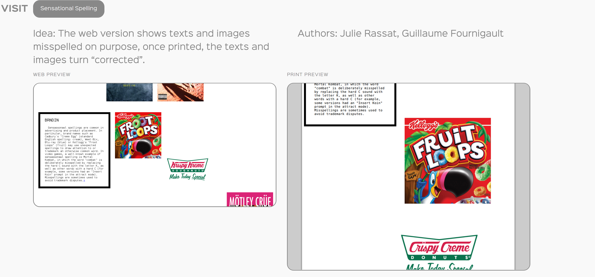

# why are these slides so ugly?

&nbsp;

### silvio lorusso

---

# assignment

---

conceive, write and design your thesis for the following media:

---

1. **web** (HTML/CSS/JavaScript, distribution: Github)

---

2. **print** (HTML/CSS, distribution: Lulu/Print on Demand)

---

3. **presentation** (HTML/CSS/JavaScript/presentation framework, distribution: browser/Open Day)

--- 

Extra. **theses' archive landing page** 

---

"mh, this presentation thing is new…"

---

big statement: the slide deck as the quintessential medium of the contemporary designer

--- 

# the age of talk

---

--- 

---

---

# performativity / virtuosity

---

the elements of a presentation are:

1. voice
2. body
3. slides (optional) 
4. space
5. public

---

# a polarized medium

---

---

---

---

# rubber ducking

---

---

"Insights are often found by simply describing the problem aloud."

---

"so, why are these slides so ugly?"

---

# slide cultures

---

in this case I'm using Big, "the antidote to your presentation procrastination" for "messy hackers" 

---

.

---

# web + print

---

# print = CMD + P

---

PrePostPrint

---

---

.

---

# print on demand

---

---

---

---

---

# disintermediation

---

---

---

---

---

---

---

---

---

---

---

---

"It is the desire of artists that their ideas be understood by as many people as possible. Books make it easier to accomplish this." (LeWitt, 1976)

---

"Print-on-demand is fast, cheap, and light. It exists outside the power structures of publishers and distributors." (ABC, 2014)

---

# prosumerism

---

.

---

# p-dpa.net

---

